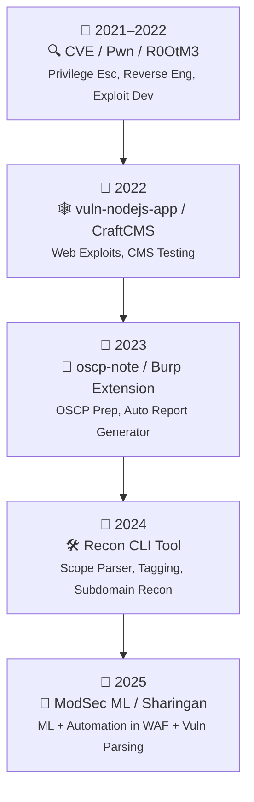

# 🧑‍💻 W0rkkd4tt – Offensive Security Engineer

📧 Email: datnguyenlequoc2001.com  
🔗 GitHub: [github.com/w0rkd4tt](https://github.com/w0rkd4tt)  
🛡️ Pentester | Recon Automation | Burp Suite Certified Practitioner  

---

## 💡 Summary

Offensive security engineer với nền tảng mạnh về pentesting, code audit, và tự động hóa bảo mật. Có kinh nghiệm phát triển công cụ tích hợp sâu với Burp Suite để tự động hoá quy trình tìm bug và generate báo cáo bảo mật. Tập trung vào **SQLi**, **XSS**, **logic bugs**, **auth bypass**, và **RCE qua code review**.

---

## ⚙️ Kỹ năng chính

- ✅ Web Application Pentesting (OWASP Top 10, logic flaws, chained exploits)
- ✅ Code Review & Exploit Development (PHP, JS, Python)
- ✅ Recon & Automation (Burp Extension, CLI tools, OSINT)
- ✅ Report Writing & Vulnerability Disclosure
- ✅ Burp Suite Extension, Burp Scanner Integration
- ✅ Scripting: Python, Bash, Go (cơ bản), SQLi payloads

---

## 🛠️ Dự án cá nhân nổi bật

### 🔍 Burp Extension – Auto Scan + Report Generator
> Tự động crawl targets từ HackerOne, Bugcrowd, Chaos Dataset.  
> Gán tag, lọc trùng, phân loại asset theo scope & tech stack.
> Tích hợp sâu với Burp Scanner để tự động scan và generate report dạng md và json.

### 📓 oscp-note
> Tổng hợp lệnh và cheat sheet phục vụ thi OSCP và pentest thực chiến.

### 📡 Project-machinelearning-in-Modsec_NGINX
> Ứng dụng Machine Learning để tối ưu rule detection trong ModSecurity + NGINX.

### 🧿 Sharingan (Private)
> Bộ tool hỗ trợ đọc và phân tích tự động các kết quả scan/vuln. *(Private repo)*

### 🌐 Django-To-Do-list-with-user-authentication
> Ứng dụng web mẫu dùng để luyện auth bypass, CSRF, và logic flaws.

### 🔧 CVE / Pwn / R0OtM3
> Các repo phục vụ nghiên cứu lỗ hổng, khai thác local privilege escalation & reverse engineering.

---

---

## 🔧 Công cụ & Tech Stack

| Mảng     | Công cụ                                     |
|----------|---------------------------------------------|
| Recon    | amass, httpx, gau, hakrawler, nuclei        |
| Exploit  | Burp Suite Pro, custom scripts, Postman     |
| Dev      | Python, Flask, Go (basic), Git              |
| Platform | Linux, VPS, tmux, Docker                    |

---

## 📜 Chứng chỉ & Học tập

- 🎯 **Burp Suite Certified Practitioner**  
- 📖 Tự học từ HackTheBox, PortSwigger labs

---

## 📞 Liên hệ

> Rất sẵn sàng chia sẻ kiến thức, hợp tác dự án.

**w0rkkd4tt**  
📬 Telegram: [@w0rkkd4tt](https://t.me/w0rkkd4tt)
